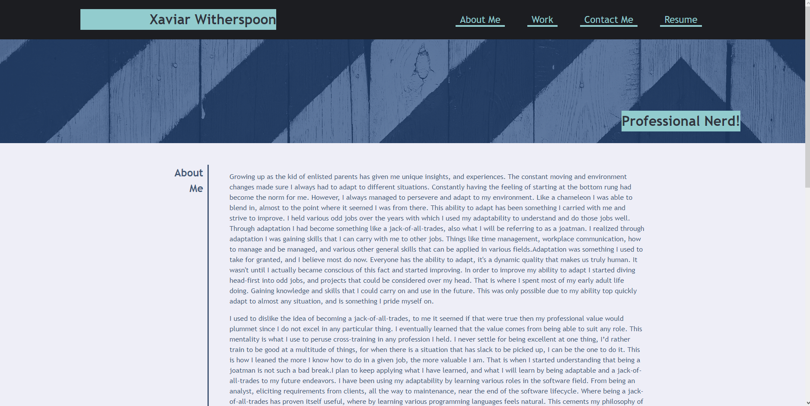
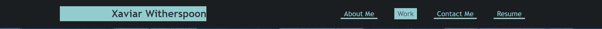
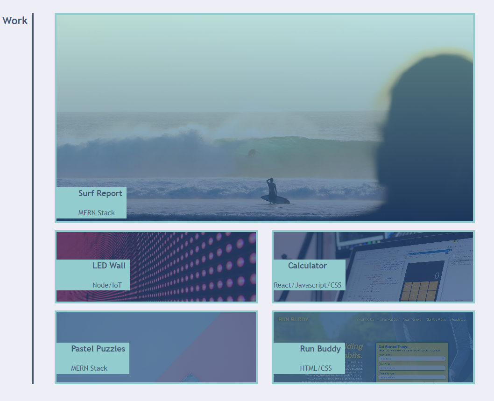
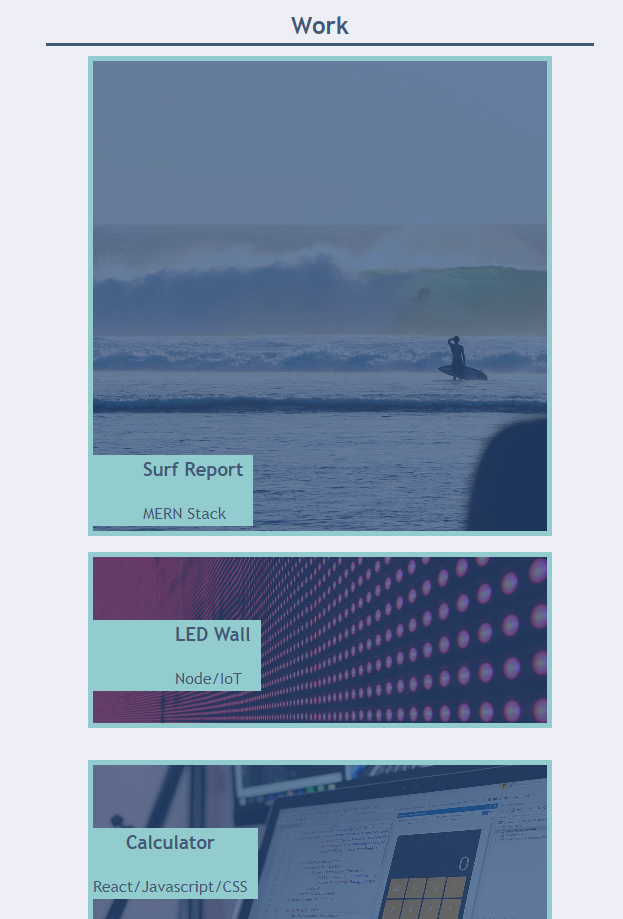

# First-Portfolio

## Description

This project is part of my week 2 challenge. The purpose of this project is to demonstrate my understanding and usage of flex-box and advanced CSS styling techniques. the site can be accessed here: https://codemonkeyspoon.github.io/First-Portfolio/ 

## Site Preview

## Features

### Hover Effects

### Resposiveness

